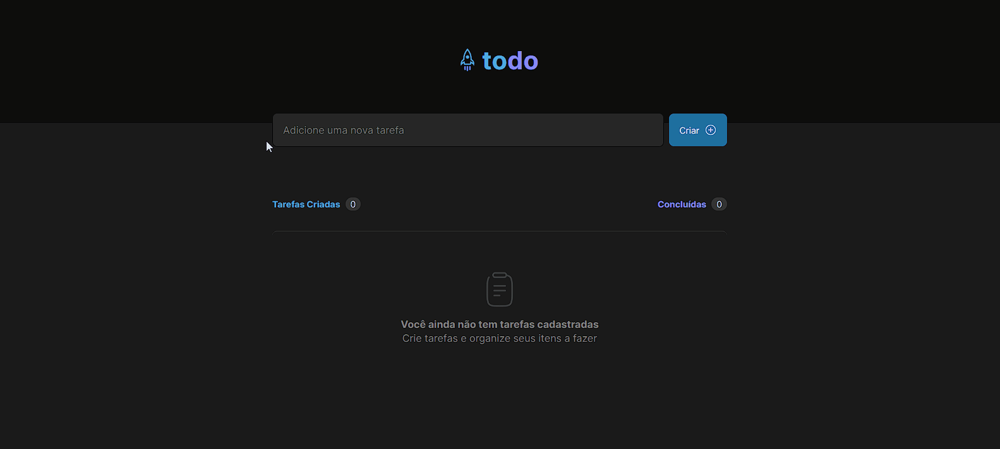
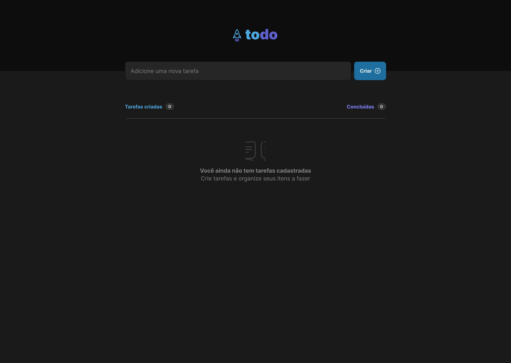
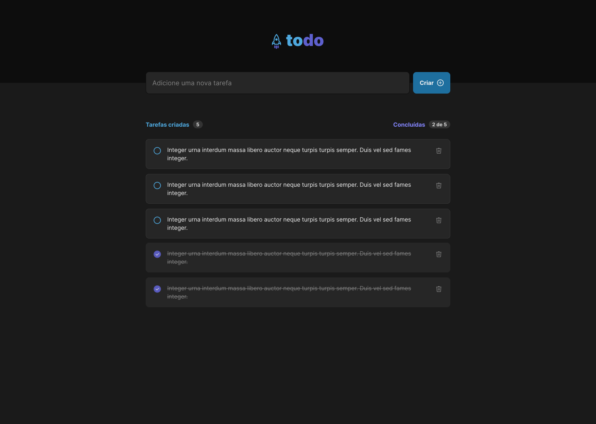

<h1 align="center">
    To Do List
</h1>
<p align="center">

</p>


<p align="center">
🔗<a href="https://kreitmaier.github.io/react-to-do-list/">Acesse o projeto clicando aqui</a>
</p>

<p align="center">
 <a href="#"></a> 
 <a href="#"></a>  
 <a href="#"></a> 
 <a href="#"></a>  
 <a href="https://github.com/Kreitmaier/react-to-do-list/blob/main/LICENSE"></a>  
</p>

<p align="center">
 <a href="#💻-sobre-o-projeto">Sobre o projeto</a> •
 <a href="#🎨-layout">Layout</a> • 
 <a href="#🛠-tecnologias">Tecnologias</a> • 
 <a href="#🚀-como-executar-o-projeto">Como executar o projeto</a> • 
 <a href="#👨‍💻-autor">Autor</a>
</p>	
    
## 💻 Sobre o projeto
Desafio realizado com o intuito de testar os conceitos fundamentais do React que foram adquiridos durante o primeiro módulo do curso de [React](https://lp.rocketseat.com.br/ignite) da [Rocketseat](https://www.rocketseat.com.br/). 

O desafio consiste em desenvolver uma aplicação de controle de tarefas de acordo com o layout disponibilizado no [Figma](https://www.figma.com/), apesar de simples o aplicativo, durante o desenvolvimento foi possível exercitar os conceitos de Estado, Imutabilidade de estado, Listas e chaves no ReactJs, Propriedades e Componentização.

### 📝Features

- Adicionar uma tarefa;
- Marcar e desmarcar uma tarefa como concluída;
- Remover uma tarefa da listagem;
- Mostrar o progresso de conclusão das tarefas;

## 🎨 Layout

O layout da aplicação está disponível no Figma: 

<a href="https://www.figma.com/file/EPootZeydHCdDR7mEIraa2/ToDo-List-(Copy)?node-id=0%3A1&t=7Ajw8F2fRtyKZg9M-0">
  
</a>

### Web

<p align="center" style="display: flex; align-items: flex-start; justify-content: center;">
  
  
  

</p>

## 🛠 Tecnologias

As seguintes ferramentas foram usadas na construção do projeto:

-  [React](https://pt-br.reactjs.org/)
-  [TypeScript](https://www.typescriptlang.org/)
-  [CSS Modules](https://github.com/css-modules/css-modules)
-  [HTML5](https://developer.mozilla.org/en-US/docs/Web/HTML)
-  [Vitejs](https://vitejs.dev/)

### Dependências -  [NPM](https://www.npmjs.com/)
- [uuid](https://www.npmjs.com/package/uuid)
- [phosphor-react](https://www.npmjs.com/package/phosphor-react)

## 🚀 Como executar o projeto

### Pré-requisitos

Antes de começar, você vai precisar ter instalado em sua máquina as seguintes ferramentas:
 [Git](https://git-scm.com) e  [Node.js](https://nodejs.org/en/). 
Além disto é bom ter um editor de texto para trabalhar com o código por exemplo o  [VSCode](https://code.visualstudio.com/).

### :arrow_forward: Rodando a aplicação web (Front End)

```bash
# Clone este repositório
$ git clone https://github.com/Kreitmaier/react-to-do-list.git

# Acesse a pasta do projeto no seu terminal/cmd
$ cd react-to-do-list

# Instale as dependências
$ npm install

# Execute a aplicação em modo de desenvolvimento
$ npm run dev

# A aplicação será aberta na porta:5173 - acesse http://localhost:5173
```

## 👨‍💻 Autor

| <br><sub><b>Douglas Kreitmaier</b></sub>   |
| :---: | 

<p>👋 Fique à vontade para entrar em contato! </p>

[](www.linkedin.com/in/douglas-kreitmaier/) <br> [](mailto:douglasklopes@gmail.com)

